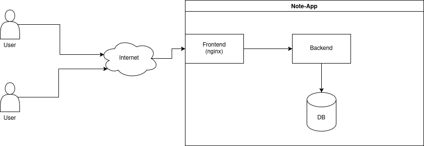

# Dokumentation
[[_TOC_]]
## Beschreibung
#### Inhalt der Anwendung
Diese Anwendung ermöglicht das Erstellen von Notizen
mittels Markdown-Syntax. Diese Notizen werden in HTML gerendert und angezeigt.
Ein Benutzer kann sich mit einer E-Mail Adresse und Passwort registrieren und sich ebenso
mit den gleichen Angaben anmelden. 
Dabei haben wir sichergestellt, dass unsere Anwendung sicher ist vor Angriffen wie
XSS, CSRF, SQL Injection, DoS-Attacken, User Enumeration und haben uns bei der Implementierung an die Empfehlungen von OWASP gerichtet.


Diese Grafik zeigt den Aufbau der Anwendung. 
Das Frontend ist nach außen geöffnet und dient als proxy für das Backend.
Mithilfe von docker sind die Datenbank und das Backend nicht direkt nach außen erreichbar. 
Dadurch kann man von außen nicht auf die Datenbank zugreifen und einige Absicherungen, die für das Frontend angelegt sind, decken auch das Backend ab (bspw. rate limit).


#### Gruppenmitglieder: 
  - Kaylin Althoff
  - Maxim Walter

### Verwendete Technologien

#### Backend:
- **Spring Boot:** Wir haben *Spring Boot* verwendet, um ein stabiles Backend zu haben, was
  durch *Spring Security* viele Sicherheitsfeatures mitbringt. Dabei war der *SecurityContextFilter*
  nützlich, um die Authentifizierung und Autorisierung zu handhaben. Dazu haben wir *JPA* benutzt,
  um *ORM* zu nutzen bzw. die Datenbankzugriffe zu erleichtern. 
- **Maven:** Als Build-Tool haben wir *Maven* verwendet, um die Abhängigkeiten zu verwalten und das Projekt zu bauen.
- **Java** Wir haben *Java* als Sprache verwendet, da *Java* eine sichere Programmiersprache ist und diese in *Spring Boot* gebraucht wird.

#### Frontend:
- **React:**  Wir haben *React* verwendet, um einfache Komponenten zu erstellen und eine Single-Page-Application (SPA) zu bauen.
- **Vite:** Als Build-Tool haben wir *Vite* verwendet, um das Frontend zu bauen und die Abhängigkeiten zu verwalten, da
    *Vite* schneller als andere Build-Tools ist und es als veraltet gilt *Create-React-App* für neue Projekte zu verwenden.
- **TypeScript:** Wir haben statt *JavaScript* als Programmiersprache *TypeScript* verwendet, um typisierten Code im Frontend zu schreiben.
- **Nginx:** Wurde gewählt um das Frontend zu hosten, da es gleichzeitig auch als Reverse-Proxy für das Backend konfiguriert werden kann.
    Außerdem wurde es auch mit einem *Rate-Limit* und einer *Content Security Policy* versehen.

#### Datenbank:
- **PostgreSQL:** Wir haben *PostgreSQL* als relationale Datenbank verwendet, um die Benutzerdaten und Notizen zu speichern.
Die Wahl fiel auf *PostgreSQL*, da es uns beiden vertraut ist.

#### Testing
- **Vitest:** Um Frontend Unit Tests zu schreiben, haben wir *Vitest* verwendet, da es gut mit *Vite* zusammenarbeitet und schnelle Tests ermöglicht.
- **Spring Boot Test:** Um Backend Tests zu schreiben, haben wir *Spring Boot Test* verwendet, damit wir die mitgelieferten Testfunktionen von *Spring Boot* nutzen können. Hierbei haben wir keine Integrationstest
verwendet, sondern simple Unit Tests geschrieben.

#### Infrastruktur
- **GitLab:** Wir haben das *GitLab* der *THM* gewählt, aus persönlicher Präferenz.
- **Docker:** Ist durch die Projektbeschreibung vorgegeben. Wird zum builden und ausführen der Anwendung und ihrer Komponenten verwendet.

### Dependencies
#### Backend


| Dependency (ArtifactId)        | Version          | Nutzen                                                             |
|--------------------------------|------------------|--------------------------------------------------------------------|
| spring-boot-starter-data-jpa   | 4.0.0 (parent)   | JPA & Hibernate für Datenbankzugriff und ORM                       |
| spring-boot-starter-security   | 4.0.0 (parent)   | Basis für Authentifizierung & Autorisierung                        |
| spring-security-crypto         | 7.0.0            | Kryptografische Utilities (PasswordEncoder, Hashing, etc.)         |
| jsoup                          | 1.22.1           | HTML-Parsing & Sanitizing (z. B. Schutz vor XSS)                   |
| zxcvbn                         | 1.9.0            | Bewertung der Passwortstärke                                       |
| bcprov-jdk18on                 | 1.83             | BouncyCastle Crypto Provider (starke Kryptografie, RSA, AES, etc.) |
| spring-boot-starter-validation | 4.0.0 (parent)   | Bean Validation (Jakarta Validation / Hibernate Validator)         |
| spring-boot-starter-web        | 4.0.0 (parent)   | REST APIs, Embedded Server, JSON (Spring MVC)                      |
| java-jwt                       | 4.5.0            | Erstellung & Validierung von JWTs (Auth0)                          |
| postgresql                     | 4x.x.x (managed) | PostgreSQL JDBC Treiber                                            |
| spring-boot-starter-mail       | 4.0.1            | E-Mail-Versand via JavaMail                                        |
| spring-boot-starter-test       | 4.0.0 (parent)   | Test-Frameworks (JUnit, Mockito, AssertJ, etc.)                    |

<br>

#### Frontend

**Production** <br>

| Name                       | Version | Nutzen                                                                                     |
|----------------------------|---------|--------------------------------------------------------------------------------------------|
| @zxcvbn-ts/core            | ^3.0.4  | Kernbibliothek zur Bewertung der Passwortstärke (zxcvbn in TypeScript).                    |
| @zxcvbn-ts/language-common | ^3.0.4  | Gemeinsame Sprach- und Musterdefinitionen für zxcvbn (z. B. Namen, Tastaturmuster).        |
| @zxcvbn-ts/language-de     | ^3.0.2  | Deutsche Sprachdaten für zxcvbn (z. B. deutsche Wörter, Namen).                            |
| dompurify                  | ^3.3.1  | Sanitizing von HTML zur Vermeidung von XSS-Angriffen (z. B. bei User-Input oder Markdown). |
| jwt-decode                 | ^4.0.0  | Dekodieren von JWTs im Frontend (z. B. Auslesen von Claims, Ablaufzeit).                   |
| marked                     | ^17.0.1 | Markdown-Parser zum Umwandeln von Markdown in HTML.                                        |
| react                      | ^19.2.3 | Core-Bibliothek für den Aufbau der UI mit Komponenten.                                     |
| react-dom                  | ^19.2.3 | Rendering von React-Komponenten in den DOM (Browser).                                      |
| react-router               | ^7.12.0 | Client-seitiges Routing (Navigation zwischen Seiten/Views).                                |


**Development** <br>

| Name                         | Version | Nutzen                                                               |
|------------------------------|---------|----------------------------------------------------------------------|
| @eslint/js                   | ^9.39.2 | Offizielle ESLint-Regeln für JavaScript.                             |
| @testing-library/jest-dom    | ^6.9.1  | Zusätzliche DOM-Matcher für Tests (z. B. toBeInTheDocument).         |
| @testing-library/react       | ^16.3.1 | Utilities zum Testen von React-Komponenten aus Usersicht.            |
| @testing-library/user-event  | ^14.6.1 | Simulation realistischer Benutzerinteraktionen (Clicks, Tastatur).   |
| @types/node                  | ^25.0.6 | TypeScript-Typdefinitionen für Node.js.                              |
| @types/react                 | ^19.2.8 | TypeScript-Typdefinitionen für React.                                |
| @types/react-dom             | ^19.2.3 | TypeScript-Typdefinitionen für ReactDOM.                             |
| @vitejs/plugin-react         | ^5.1.2  | Vite-Plugin für React (Fast Refresh, JSX-Support).                   |
| @vitest/coverage-v8          | ^4.0.16 | Code-Coverage für Vitest basierend auf V8.                           |
| eslint                       | ^9.39.2 | Linter zur statischen Codeanalyse und Einhaltung von Code-Standards. |
| eslint-plugin-react-hooks    | ^7.0.1  | ESLint-Regeln für korrekte Verwendung von React Hooks.               |
| eslint-plugin-react-refresh  | ^0.4.26 | ESLint-Unterstützung für React Fast Refresh.                         |
| eslint-plugin-vitest-globals | ^1.5.0  | Stellt Vitest-Globals (describe, it, expect) für ESLint bereit.      |
| globals                      | ^17.0.0 | Sammlung globaler Variablen (Browser, Node, etc.) für ESLint.        |
| jsdom                        | ^27.4.0 | DOM-Implementierung für Tests außerhalb des Browsers.                |
| typescript                   | ~5.9.3  | TypeScript-Compiler für typisierte JavaScript-Entwicklung.           |
| typescript-eslint            | ^8.46.4 | Integration von TypeScript in ESLint.                                |
| vite                         | ^7.2.4  | Build-Tool und Dev-Server für moderne Frontend-Projekte.             |
| vitest                       | ^4.0.16 | Schnelles Test-Framework für Vite-basierte Projekte.                 |


## Infrastruktur

### CI/CD
Für die CI Pipeline musste ein eigener Runner angelegt werden, da das _GitLab_ der _THM_ keinen _Docker_-fähigen Runner bereitstellt.
Dafür wurde ein [passendes _Docker_ image](https://hub.docker.com/r/gitlab/gitlab-runner/) von _GitLab_ verwendet und wie folgt konfiguriert.

```shell
docker run -d --name gitlab-runner --restart always \
  -v <path to docker socket>:/var/run/docker.sock \
  -v gitlab-runner-config:/etc/gitlab-runner \
  -v gitlab-runner-var-lib-docker:/etc/gitlab-runner \
  gitlab/gitlab-runner:alpine
```

```toml
# config.toml in gitlab-runner-config volume
[[runners]]
    url = "https://git.thm.de"
    token = "<gitlab-runner-token>"
    executor = "docker"
    request_concurrency = 3
    [runners.docker]
        tls_verify = false
        host = "unix:///var/run/docker.sock"
        image = "docker:29.1.2-cli"
        privileged = true
        disable_cache = false
        volumes = ["/certs/client", "/cache", "gitlab-runner-var-lib-docker:/var/lib/docker"]
```

Für den _Dependabot_ wurde das image [dependabot-gitlab/dependabot](https://gitlab.com/dependabot-gitlab/dependabot) genutzt. 
Dabei handelt es sich zwar um ein inoffizielles Projekt, das allerdings viel verwendet und konstant weiterentwickelt wird mit regelmäßigen Commits. 

Als Version wurde die v3.75.0-alpha.1 gewählt, da es die aktuellste lauffähige Version war.
```shell
curl -o depandabot-compose.yml https://gitlab.com/dependabot-gitlab/dependabot/-/raw/v3.75.0-alpha.1/docker-compose.yml
docker compose -f depandabot-compose.yml up -d
```
Der _Dependabot_ benötigt einen Access Token mit der Rolle `Developer` und den Scopes `api` und `read_registry`.
```yaml
# notwendige Anpassungen in dependabot-compose.yml
# ...
SETTINGS__GITLAB_ACCESS_TOKEN: "<gitlab-access-token>"
SETTINGS__GITLAB_URL: https://git.thm.de
# ...
```

Beide Systeme (runner und dependabot) waren nicht durchgänging verfügbar, da diese lokal auf einem der Laptops der Entwickler*innen ausgeführt wurden.
Ein seperates Gerät wäre für die Entwicklung besser gewesen, stand allerdings nicht zur Verfügung.

### Verwendete IDE
Wir haben ein Monorepository erstellt und _IntelliJ IDEA Ultimate_ für unser gesamtes Projekt (Backend, Frontend, etc.) verwendet,
da _IntelliJ_ sowohl _Java/Spring Boot_ als auch _TypeScript/React_ sehr gut unterstützt und viele nützliche Features
für die Entwicklung mitbringt. 

### Struktur des Entwicklungsprozesses
Wir haben _GitLab_ verwendet und Issues erstellt,
die wir jeweils in einem eigenen Branch bearbeitet haben. 
Den Main-Branch haben wir geschützt, damit wir nur über die 
Merge-Request die Änderungen aus dem Feature-branch übernehmen
und ein direkter Push auf dem Main-Branch nicht möglich ist.

Außerdem haben wir uns zusammen wöchentlich in der Übung oder über _Discord_ getroffen, um
gemeinsam die Merge Requests durchzugehen, Probleme zu besprechen
und unsere Aufgaben/TODOs zu kommunizieren.

Für unser Projekt haben wir LLMs benutzt. Hauptsächlich für das
Debugging bzw. die Fehlersuche. Wenn wir sicherheitsrelevante Features implementieren
mussten und dabei LLMs verwendet haben, haben wir immer geschaut, ob der Vorschlag der LLMs
mit den _OWASP_ Vorgehen bzw. der jeweiligen Dokumentation übereinstimmt und eigenständig überprüft, 
ob vorgeschlagene Libraries gepflegt und nicht veraltet sind.
Um Zeit zu sparen, wurden für das Layout im Frontend fast alle _CSS_ Dateien generiert und an dieser Stelle kein Sicherheitsrisiko bestand.

Außerdem haben wir darauf geachtet, dass unsere .env Datei nicht ins Repository gelangt,
indem wir eine .gitignore Datei erstellt haben, die diese Datei ignoriert und die application.properties
die sensiblen Daten aus der .env Datei liest. 
Für die Bewertung des Projekts wird die .env Datei, kurz vor Abgabe, trotzdem gepusht.


## Funktionen

### Anmeldung
Der registrierte **und** verifizierte Nutzer kann sich mit seiner E-Mail Adresse
und seinem Passwort anmelden. 
Als Authentifizierungsmechanismus haben wir JSON Web Tokens (JWT) gewählt
mit rotierenden Refreshtokens, um besser gegen Token Replay-Angriffe geschützt zu sein.
Der JWT Token besitzt eine Gültigkeit von 10 Minuten und besitzt
als sub-claim die Nutzer-UUID, um den Nutzer zu identifizieren und einen
custom-claim für den Hash des Fingerprints.
Hierbei werden **keine** persönlichen Daten im Token gespeichert, um Datenschutz einzuhalten.
Als Signieralgorithmus haben wir `HS256` (HMAC mit SHA-256) gewählt, 
Damit der Nutzer nach Ablauf
des Tokens nicht erneut seine Anmeldedaten eingeben muss, haben wir Refresh Tokens
implementiert, die eine Gültigkeit von 7 Tagen besitzen.

Hierbei wird der JWT Accesstoken im Speicher (Memory) des Clients gehalten, anstelle
von LocalStorage oder SessionStorage, um Angriffe durch XSS zu erschweren.

Um Ressourcen bzw Routen abzufragen, die eine Authentifizierung benötigen,
muss der Client...

[//]: # (TODO: Satz oben vervollständigen)

**JSON Web Token**
Der JWT wird mit dem `HS256` Algorithmus signiert und besitzt folgende Claims:
- **sub**: Nutzer-UUID (eindeutige Identifikation des Nutzers)
- **iat**: Issued At (Zeitpunkt der Token-Erstellung)
- **exp**: Expiration Time (Ablaufzeitpunkt des Tokens, 10 Minuten nach Erstellung)
- **fgp**: SHA-256 Hash des Fingerprints (custom-claim, der den Hash vom __Secure_Fgp Cookie enthält)

Die Signierung der JSON Web Tokens (JWT) erfolgt mittels HMAC mit einem starken, kryptografisch zufällig erzeugten geheimen Schlüssel.
Der Secret Key wurde mit dem OpenSSL‑Tool in der Linux‑Konsole mithilfe des Befehls `openssl rand -hex 64` generiert.
Dieser Befehl erzeugt 64 Bytes (512 Bit) kryptografisch sicheren Zufalls (CSPRNG), der als Hex‑String ausgegeben wird (144 Zeichen).
Das entspricht den [OWASP Anforderungen](https://cheatsheetseries.owasp.org/cheatsheets/JSON_Web_Token_for_Java_Cheat_Sheet.html#weak-token-secret), dass der Secret Key mindestens 64 Zeichen und kryptografisch sicher generiert sein muss.
Dieses Secret wird in einer .env Datei gespeichert und nicht ins Repository gepusht und wird von der `application.properties`-Datei gelesen.
Die JWT Library `java-jwt` von Auth0 wird verwendet, um die Tokens zu erstellen und zu validieren. Auth0 bietet eine große 
[Dokumentation](https://auth0.com/docs) und die Library wird regelmäßig gepflegt mit einem [aktuellen Release](https://github.com/auth0/java-jwt/releases/tag/4.5.0) im Januar 2026 mit der Version 4.5.0.

**Refresh Token**

**CSRF Token**

**Ablauf**
1. Der Nutzer sendet eine POST-Anfrage an den `/login` Endpoint mit seiner E-Mail Adresse und Passwort.
2. Der Server überprüft die Anmeldedaten. Wenn diese korrekt sind, werden folgende Schritte durchgeführt:
    - Set-Cookie: REFRESH_TOKEN=< token >, httpOnly, Secure, SameSite=Strict, Path=/api/auth/rt MaxAge 7 Tage
    - Set-Cookie: __Secure_Fgp, httpOnly, Secure, SameSite=Strict, Path=/ MaxAge 10 Minuten (<= Access Token Gültigkeit)
    - Set-Cookie: XSRF-TOKEN, Secure, SameSite=Strict, Path MaxAge
    - Response Body: { accessToken: }

   - Dieser Fingerprint wird gehasht (SHA-256) und im JWT Token als custom-claim gespeichert.
   - Ein JWT Token wird erstellt, der die Nutzer-UUID (sub-claim) und den Hash des Fingerprints (custom-claim) enthält.
   - Ein Refresh Token wird generiert und in der Datenbank zusammen mit der Nutzer-UUID und dem Ablaufdatum gespeichert.
   - Spring setzt ein 
3. Möchte ein Nutzer eine geschützte Ressource abrufen, sendet der Client den JWT Access Token im Authorization Header mit.

[//]: # (TODO: Ablauf vervollständigen)

Felder durchgehen:

Wenn JWT abgelaufen dann,

Wenn Logout dann,

Sicherheits analyisieren


Das System ist sicher vor CSRF-Angriffen, da der JWT


```java
 @Bean
    public SecurityFilterChain securityFilterChain(HttpSecurity http) {

        http
            .cors(AbstractHttpConfigurer::disable)
            .csrf(csrf -> csrf
                    .ignoringRequestMatchers(
                            "/api/auth/login",
                            "/api/auth/register",
                            "/api/auth/verify-email",
                            "/api/documents/public",
                            "/api/documents/public/search"
                    )
                  .spa()
            )
            .sessionManagement( session -> session
                    .sessionCreationPolicy(SessionCreationPolicy.STATELESS)
            )
            .exceptionHandling(ex -> ex
                    .authenticationEntryPoint((request, response, authException) -> response.sendError(HttpServletResponse.SC_UNAUTHORIZED, "Unauthorized"))
                    .accessDeniedHandler((request, response, accessDeniedException) -> response.sendError(HttpServletResponse.SC_FORBIDDEN, "Forbidden"))
            )
            .authorizeHttpRequests(auth -> auth
                   .requestMatchers(
                           "/api/documents/public",
                           "/api/documents/public/search",
                            "/api/auth/register",
                            "/api/auth/login",
                            "/api/auth/verify-email",
                            "/api/auth/rt/refresh-token",
                            "/api/auth/rt/logout"
                   ).permitAll().anyRequest().authenticated()
            )
            .formLogin(AbstractHttpConfigurer::disable)
            .httpBasic(AbstractHttpConfigurer::disable)
            .addFilterBefore(jwtFilter, UsernamePasswordAuthenticationFilter.class);
        return http.build();
    }
```

 

### Registrierung
Um einen Nutzer registrieren zu können, muss dieser eine gültige E-Mail Adresse
besitzen und ein Passwort, welches der Passwordvalidation (nach zxcvbn-Score)
entspricht, übergeben. Nach der Registrierung wird ein Bestätigungslink an die angegebene E-Mail Adresse
gesendet, um die E-Mail Adresse zu verifizieren und um sicherzugehen, dass die vom Nutzer angegebene E-Mail Adresse in seinem Besitz ist.
Dabei werden zunächst die Daten in einer temporären Tabelle (Registration_Request) gespeichert, bis der Nutzer
seine E-Mail Adresse bestätigt hat. Ist dies passiert, dann werden die Daten
in die eigentliche Nutzertabelle (User) übertragen und der Eintrag in der temporären Tabelle gelöscht.
Der Nutzer muss auf den Link in der E-Mail klicken, um die Registrierung abzuschließen. Dies muss innerhalb
von 3 Stunden geschehen, da der Link sonst ungültig wird.
Außerdem ist der Link nur einmalig verwendbar.
Der Token für den Bestätigungslink muss sicher sein
und zufällig generiert werden, um sicherzustellen, dass nur der Besitzer der E-Mail Adresse
die Registrierung abschließen kann. Dabei sind für unseren Fall *Cryptographically Secure Pseudo-Random Number Generators* [CSPRNG](https://cheatsheetseries.owasp.org/cheatsheets/Cryptographic_Storage_Cheat_Sheet.html#secure-random-number-generation)
wichtig. In Java nutzt man daher die `java.security.SecureRandom` Library, um kryptografisch sichere Zufallszahlen zu generieren.

Folgender Code zeigt die Generierung eines sicheren, zufälligen Tokens mit 256 Bit (32 Bytes) Länge
```java
public String generateOpaqueToken() {
    byte[] randomBytes = new byte[32];
    secRandom.nextBytes(randomBytes);
    return base64Encoder.encodeToString(randomBytes);
}
```
Anmerkung: Die Sicherheit des Tokens ist nicht abhängig von der Länge des Tokens, sondern von der Entropie,
also wie die Bytes zufällig generiert werden. Ein 32 Byte langer Token ist daher ausreichend sicher.

Bei der Speicherung des URL-Tokens haben wir uns an die OWASP Vorgaben aus dem ["Passwort vergessen" Cheat Sheet](https://cheatsheetseries.owasp.org/cheatsheets/Forgot_Password_Cheat_Sheet.html#implementing-password-reset-tokens) gehalten,
obwohl es hier nicht um ein Passwort zurücksetzen geht, sondern um die Verifizierung der E-Mail Adresse.
Als Angabe gibt OWASP _"stored securely"_ an und verweist auf das [Password Storage Cheat Sheet](https://cheatsheetseries.owasp.org/cheatsheets/Password_Storage_Cheat_Sheet.html),
jedoch ist langsame Hashen von Tokens nicht sinnvoll, da diese nur kurzlebig sind und die Performance
beeinträchtigen würden. Daher haben wir uns entschieden, den Token mit SHA3-256 zu hashen.
Die Kombination aus einem kryptografisch sicheren, zufällig generierten Token, dem 
SHA3-256 Hash, der kurzlebigkeit des Tokens (3 Stunden) und der Einmaligkeit ist ausreichend sicher,
um die E-Mail Verifizierung via URL Tokens umzusetzen.
Speziell haben wir den SHA3-256 Algorithmus gewählt, da dieser aus der SHA3 Familie stammt,
welche als langfristig sicherer gilt als die SHA2 Familie.
Dafür haben wir folgenden Code implementiert:
```java
public String hashToken(String token) {
    try {
        MessageDigest digest = MessageDigest.getInstance("SHA3-256");
        byte[] hashedBytes = digest.digest(token.getBytes(StandardCharsets.UTF_8));
        return base64Encoder.encodeToString(hashedBytes);
    } catch (NoSuchAlgorithmException e) {
        throw new RuntimeException("Error hashing token", e);
    }
}
```
Die MessageDigest Klasse ist Teil der Java Standardbibliothek und bietet eine einfache Möglichkeit,
um Hashes mit verschiedenen Algorithmen zu generieren, weshalb keine externe Library benötigt wird.

Um Datenschutz einzuhalten, könnte man, wenn
innerhalb von 3 Stunden die E-Mail Adresse nicht bestätigt wird, die Daten
löschen, indem man einen CronJob einrichtet, der täglich die unbestätigten
Nutzer aus der temporären Tabelle löscht, was wir jedoch nicht implementiert haben.
Ist die E-Mail Adresse bereits registriert **und** verifiziert bzw. wurde der Account erfolgreich erstellt, wird bei einer erneuten Registrierung mit dieser
E-Mail Adresse die gleiche Rückmeldung ausgegeben, wie bei einer normalen Registrierung. Somit wird nicht verraten, dass
die E-Mail Adresse bereits registriert ist. Dem Besitzer der E-Mail Adresse wird jedoch eine Warn-E-Mail gesendet.
Dieser Vorgang dient, um User Enumeration zu verhindern.

Damit die Nutzer sichere Passwörter verwenden und vor Brute-Force Attacken geschützt sind,
haben wir die zxcvbn Library integriert, sowohl im Backend als auch im Frontend und nur Passwörter mit einem Score von 4 (sehr stark) erlaubt.
Passwörter mit einem Score von 0-3 werden abgelehnt und der Nutzer bekommt eine entsprechende Fehlermeldung.
Dabei gelten Passwörter mit einer Stärke von 3 als erratbar in weniger als 10^10 Versuchen laut diesem [Artikel](https://dev.to/tooleroid/password-strength-testing-with-zxcvbn-a-deep-dive-into-modern-password-security-2hl8).
Passwörter mit einem Score von 4 gelten als sehr stark und benötigen erhebliche Rechenressourcen, um diese zu erraten.

Im Frontend werden dem Nutzer zusätzlich noch Tipps während der Passworteingabe angezeigt,
wie er sein Passwort verbessern und einen höheren Score erreichen kann.
Anstatt die Passwortregeln (Mindestlänge, Sonderzeichen, etc.) selbst zu definieren,
haben wir uns für zxcvbn entschieden, da diese Library gängige Muster, Passwortlisten/Wörterbücher und
andere Faktoren berücksichtigt, um die Passwortstärke zu bewerten, die ansonsten zu aufwändig gewesen wären selber umzusetzen.
Hier ist jedoch anzumerken, dass die zxcvbn Library im Backend 
weniger aktuell (letzter Release war 2017) ist und gepflegt wird als die TypeScript Version im Frontend (`zxcvbn-ts`),
jedoch wollten wir die Passwortvalidierung im Backend und Frontend von den Libraries her konsistent halten.

Ist nun eine Registrierung mit gültigen Daten erfolgt, wird das Passwort
mit einem sicheren Algorithmus `argon2id` gehasht und in der Datenbank gespeichert. Dieser wird
von OWASP als erste Wahl empfohlen ([Password Storage Cheat Sheet](https://cheatsheetseries.owasp.org/cheatsheets/Password_Storage_Cheat_Sheet.html)).
Bei argon2id ist das Salting bereits integriert, denn
es müssen lediglich die richtigen Parameter gesetzt werden, wobei wir uns an die [OWASP Empfehlung](https://cheatsheetseries.owasp.org/cheatsheets/Password_Storage_Cheat_Sheet.html#argon2id) gehalten haben <br>

**Argon2id Parameter:**
- Saltlänge: 16 Bytes
- Hashlänge: 32 Bytes
- Speicher: 12288 MiB
- Iterationen: 3
- Parellelismus: 1

Hierbei liefert Spring Security Crypto eine eingebaute Unterstützung für Argon2id
über den `Argon2PasswordEncoder`, welcher die oben genannten Parameter standardmäßig verwendet, jedoch 
wird intern noch die Bouncy Castle Library benötigt, weshalb wir die `bcprov-jdk18on` Dependency
hinzugefügt haben. Das Repository von Bouncy Castle wird regelmäßig gepflegt und ist nicht veraltet
Hier ein Einblick aus dem Repository: [Bouncy Castle GitHub](https://github.com/bcgit/bc-java/graphs/commit-activity)

Im Backend haben wir durch Bean Validation (@Min, @Max, @NotBlank, @StrongPassword (zxcvbn)) Min- und Max-Längen für die E-Mail Adresse und das Passwort festgelegt,
und eine Grundabsicherung gegen DoS-Attacken implementiert, indem wir in der Reverse Proxy 
maximal 1 Request pro Sekunde erlauben mit einem erlaubten Burst von 8.
Die Eingabefelder sind vor SQL Injections sicher, da wir JPA als Object-Relational-Mapper verwenden,
welches Prepared Statements verwendet, anstatt von String-Konkatenation für SQL Queries.
Vor Stored-XSS sind die Eingabefelder geschützt, da unsere REST-API nur JSON-Daten akzeptiert
und auch nur JSON-Daten zurückgibt. 


### Autorisierung

### Funktionen der Anwendung
#### Notiz

[//]: # (TODO: vervollständigen)
Ein Nutzer kann eine Notiz erstellen und löschen. Notizen anderer Nutzer sowohl private als auch öffentliche
können eingesehen werden, jedoch werden 
- JPA eingehen, dass es SQL Injection verhindert durch vorgefertigte Methodennamen
und bei Custom SQL-Queries via @Query Annotation Prepared Statementsverwendet werden,
anstatt String Konkatenation.
Vor allem bei der Suche

[//]: # (TODO)
#### Social-Plugin
Wenn 
Genauere Codedetail gibt es in der `SafeMarkdown.tsx` zu finden. 
Unser Social-Plugin 

[//]: # (TODO)
#### Suche
Wir haben die Suche in zwei Suchleisten aufgeteilt: Eine für öffentliche Notizen aller Nutzer
und eine für die privaten Notizen des angemeldeten Nutzers.
Der 

#### Datenschutz
Unsere Anwendung ist datenschutzkonform gestaltet. Wir speichern nur die notwendigsten Daten,
nämlich die E-Mail Adresse, das gehashte Passwort und die Notizen und löschen alle temporären Daten
wie die Registration_Request Einträge, sobald der Nutzer seine E-Mail Adresse verifiziert hat.
Der Nutzer kann jederzeit seine Notizen und seinen Account löschen, wodurch alle seine Daten aus der Datenbank entfernt werden
und kein Backup mehr existiert oder Soft-Delete durchgeführt wird.
Außerdem haben wir im Social Plugin darauf geachtet, dass das iframe mit dem Youtube Video
erst geladen wird, wenn der Nutzer auf den "_Externe Inhalte laden_" Button klickt, um keine Daten ungefragt an Youtube zu senden,
bevor der Nutzer dem zugestimmt hat.
Beim Login haben wir dem Nutzer darauf hingewiesen, dass eine Zustimmung zur Verwendung von notwendigen Cookies benötigt wird,
um die Authentifizierung zu ermöglichen.
In der JWT Payload haben wir keine persönlichen Daten gespeichert, sondern nur die Nutzer-UUID
und den Hash des Fingerprints.

### CI/CD Pipeline
#### Technische Umsetzung
Wie im Abschnitt [CI/CD](#cicd) beschrieben, wird ein gitlab-runner und ein dependabot verwendet und entsprechend konfiguriert.

Die .gitlab-ci.yml beschreibt, welche jobs wann durchgeführt werden. 
Insgesamt sind drei jobs konfiguriert: backend-test, frontend-test und der build-job.
backend-test und frontend-test werden bei jedem push durchgeführt, unabhängig vom branch.
Der build-job läuft nur auf dem main branch und wenn ein Commit Tag angelegt wird, was unter anderem bei Releases passiert.

Wie in [Testing](#testing) beschrieben werden für die Tests Vitest und Spring Boot Test verwendet. 
backend-test und frontend-test nutzen docker images (eclipse-temurin & node), unter denen diese Tests ausgeführt werden können.
build-job nutzt docker-in-docker (dind) um mit `docker compose` das Projekt zu builden und in die Container Registry zu pushen.

Der dependabot ist auf vier verschiedene package-ecosystems konfiguriert: docker, docker-compose, maven & npm.
Aufgrund dessen, dass es zwei unterschiedliche Dockerfiles im Projekt gibt laufen allerdings zwei jobs für docker, fünf insgesamt.
Zu allen ecosystems ist konfiguriert, dass vor vurnabilities gewarnt werden soll.
Alle fünf jobs sind auf tägliche runs konfiguriert, wie in [CI/CD](#cicd) beschrieben, konnte das vom dependabot aber nicht immer eingehalten werden.

#### Schwachstellen u. ihre Vorbeugungen
| Schwachstelle                                       | Vorbeugung                                                                                                                  |
|-----------------------------------------------------|-----------------------------------------------------------------------------------------------------------------------------|
| unauthorisierter Zugang zum Repository durch Tokens | Nutzen von vertrauenswürdigen, lokal ausgeführten Diensten, minimum Zugriffsrechte & Tokens werden nicht mehrfach verwendet |
| potenzieller root-Zugriff durch Docker              | Docker rootless konfigurieren & mit neuem User ausgeführt                                                                   |
| Zugriff auf Variablen in der Pipeline               | keine Variablen mit Secrets angelegt                                                                                        |

#### Datenschutz
Die einzigen personenbezogenen Daten die im Repository verwendet werden sind die Namen der Entwickler*innen und deren Usernamen. 
Zum Schutz dieser Daten greifen die Vorbeugungen aus Zeile 1 in der Tabelle oben.
